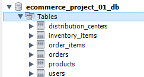
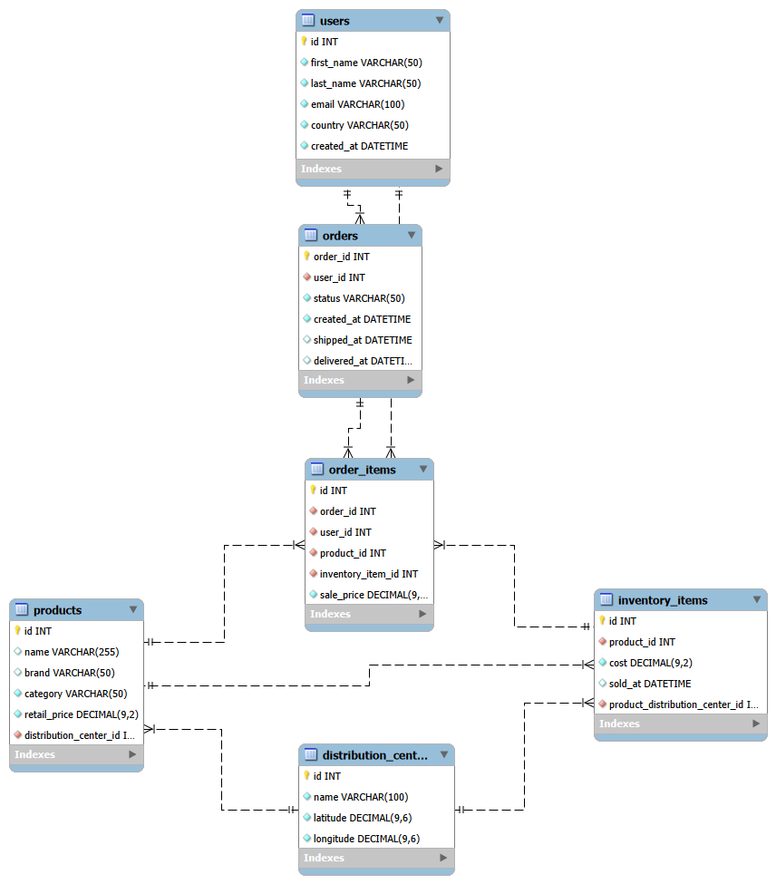
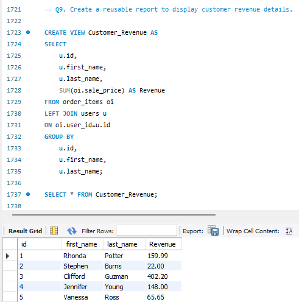

# E-Commerce Database Design & Sales Analytics using MySQL

## 📖 Project Overview

This project demonstrates the complete lifecycle of designing, building, and analyzing a relational E-Commerce database using MySQL. It includes database creation, data import, data cleaning, relationship management, exploratory data analysis, business analysis, advanced SQL concepts, and query optimization.

The primary objective of this project is to strengthen practical SQL skills required for Database Engineer, SQL Developer, ETL Tester, and Data Engineer roles by solving real-world business problems using SQL.

---

## 🎯 Project Objectives

- Design a relational E-Commerce database from scratch.
- Import and transform raw CSV datasets.
- Clean and validate data before analysis.
- Build relationships using Foreign Keys.
- Perform Exploratory Data Analysis (EDA).
- Solve business problems using SQL.
- Apply advanced SQL concepts.
- Improve query performance using indexes and execution plans.

---

## 🛠 Technologies Used

- MySQL 8.0
- MySQL Workbench
- SQL
- Microsoft Excel (Documentation)
- Git
- GitHub

---

## 📂 Dataset

The project uses an E-Commerce dataset consisting of six CSV files:

- Users
- Orders
- Order Items
- Products
- Inventory Items
- Distribution Centers

The raw CSV files were imported into MySQL and cleaned before analysis.

---

# 📁 Project Structure

```
Ecommerce-Database-Project
│
├── 01_Dataset
│
├── 02_Documentation
│   ├── Database Table Analysis
│   ├── Data Profiling Report
│   ├── Data Cleaning Strategy
│   └── Database Schema Design
│
├── 03_SQL_Scripts
│   ├── Create Database
│   ├── Create Tables
│   ├── Import Data
│   ├── Data Cleaning
│   ├── Add Foreign Keys
│   ├── Data Validation
│   ├── Exploratory Data Analysis
│   └── Business Analysis
│
├── 04_ER_Diagram
│
├── 05_Screenshots
│
└── README.md
```

---

# 🗄 Database Design

The database contains six relational tables.

- Users
- Orders
- Order Items
- Products
- Inventory Items
- Distribution Centers

The tables are connected using Primary Keys and Foreign Keys to maintain referential integrity.

---

# 📊 Entity Relationship Diagram (ERD)


---

# 🔄 Project Workflow

### 1. Database Creation

- Created the E-Commerce database.
- Designed relational tables.

### 2. Data Import

- Imported six CSV datasets into MySQL.

### 3. Data Cleaning

- Removed invalid values.
- Replaced blank values with NULL.
- Converted VARCHAR date columns into DATETIME.
- Removed timezone values from datetime columns.

### 4. Relationship Management

- Added Foreign Keys.
- Maintained referential integrity.

### 5. Data Validation

- Verified imported records.
- Checked NULL values.
- Validated relationships.

### 6. Exploratory Data Analysis

Performed SQL queries to understand:

- Customer distribution
- Product information
- Orders
- Inventory
- Revenue

### 7. Business Analysis

Solved more than **100 real-world SQL business questions** including:

- Sales Analysis
- Customer Analysis
- Product Analysis
- Inventory Analysis
- Distribution Center Analysis

### 8. Advanced SQL

Applied advanced SQL concepts including:

- Common Table Expressions (CTEs)
- Window Functions
- Views
- Stored Procedures
- Constraints

### 9. Query Optimization

Improved query performance using:

- Indexes
- EXPLAIN Execution Plan

---

# 💡 SQL Concepts Covered

## Basic SQL

- SELECT
- WHERE
- ORDER BY
- GROUP BY
- HAVING
- LIMIT

## Joins

- INNER JOIN
- LEFT JOIN
- SELF JOIN

## Aggregate Functions

- COUNT()
- SUM()
- AVG()
- MIN()
- MAX()

## Date Functions

- YEAR()
- MONTH()
- MONTHNAME()
- DATEDIFF()

## Subqueries

- Single-row
- Multi-row
- Correlated

## Common Table Expressions (CTEs)

- Single CTE
- Multiple CTEs

## Window Functions

- ROW_NUMBER()
- RANK()
- DENSE_RANK()
- LAG()
- LEAD()
- NTILE()

## Views

- CREATE VIEW
- Query reusable reports

## Stored Procedures

- IN Parameters
- OUT Parameters
- Variables
- IF...ELSE
- SELECT INTO

## Constraints

- PRIMARY KEY
- FOREIGN KEY
- NOT NULL
- UNIQUE
- CHECK
- DEFAULT

## Performance Optimization

- CREATE INDEX
- EXPLAIN

---

# 📸 Project Screenshots

## Database Overview


---

## Tables



---

## ER Diagram



---

## Data Cleaning


---

## Foreign Keys


---

## Business Analysis


---

## Window Functions


---

## Views



---

## Stored Procedures


---

## Query Optimization


---

# 📈 Project Highlights

- Designed a relational E-Commerce database from scratch.
- Imported and transformed multiple CSV datasets.
- Cleaned and validated data before analysis.
- Implemented Primary Keys and Foreign Keys.
- Solved **100+ SQL business questions**.
- Applied advanced SQL concepts including CTEs, Window Functions, Views, and Stored Procedures.
- Optimized SQL queries using Indexes and EXPLAIN.
- Created complete project documentation and ER Diagram.

---

# 🎯 Skills Demonstrated

- Database Design
- SQL Query Writing
- Data Cleaning
- Data Validation
- Data Analysis
- Business Analysis
- Query Optimization
- Relational Database Design
- Performance Tuning
- Documentation

---

# 🚀 Future Enhancements

- Build an interactive Power BI dashboard.
- Automate data loading using Python ETL.
- Deploy the database on a cloud platform.
- Add Triggers and Events.
- Extend the project with additional business reports.

---

# 👨‍💻 Author

**Vinoth Duraimanickam**

- LinkedIn: *(Add your LinkedIn URL)*
- GitHub: *(Add your GitHub URL)*

---

## ⭐ If you found this project useful, consider giving it a star.
